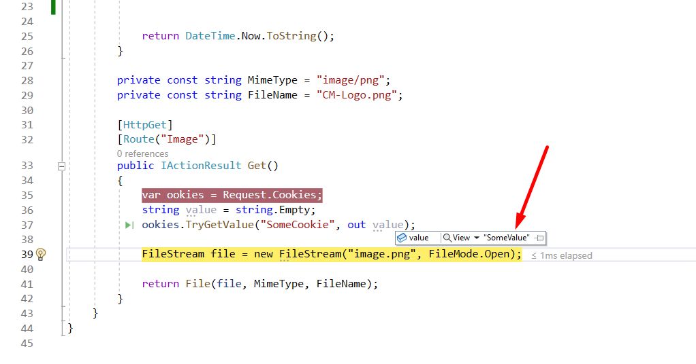

# ProductivityTools.Learning.Cookies.WebApi

In this api I am learning how to send and receive cookie with the request for image.

DateController exposes two methods:
- Get - returns date **and** sets cookie on the client side
- Image - returns image, but most important here I am validating if cookies had been sent by client. 

The idea here is to store bearer in cookie and validate it for the images which are added to the page with the img tag.

